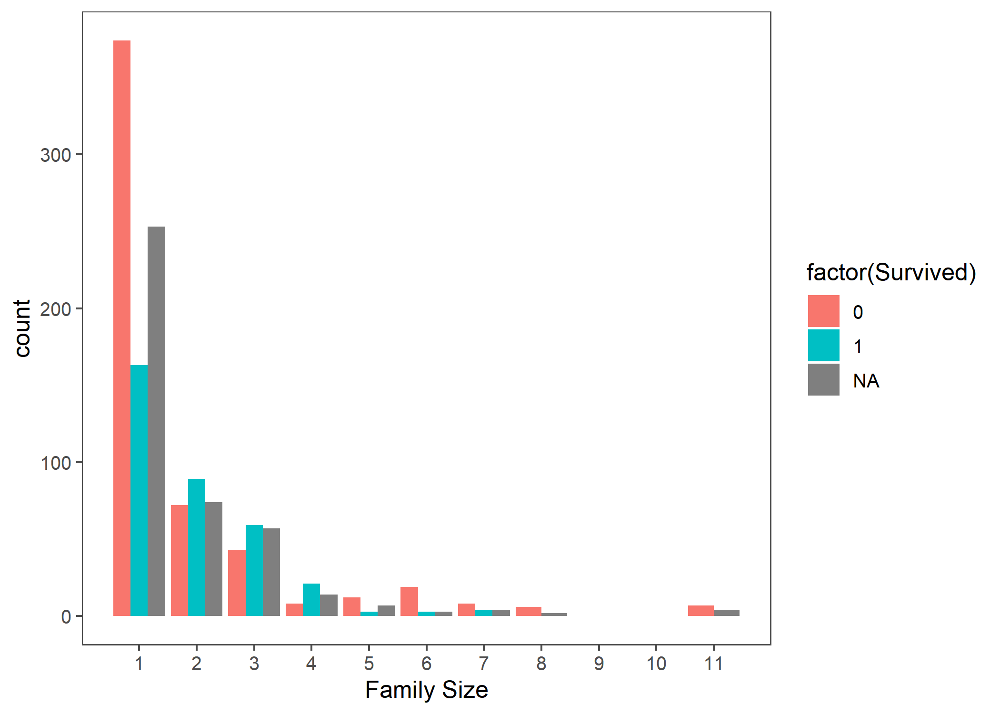
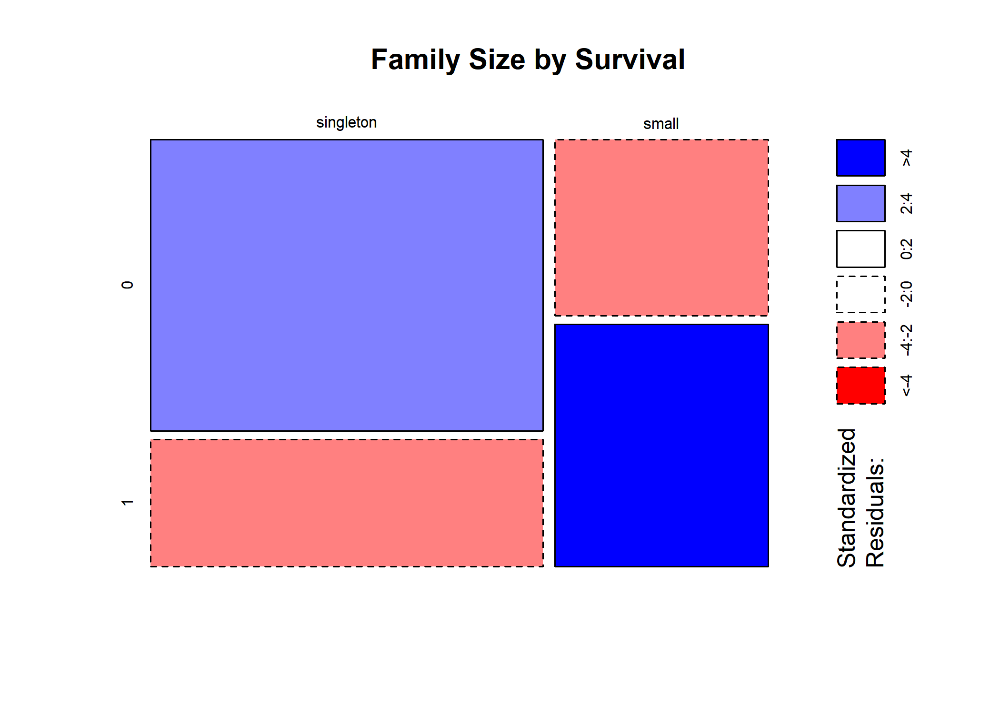
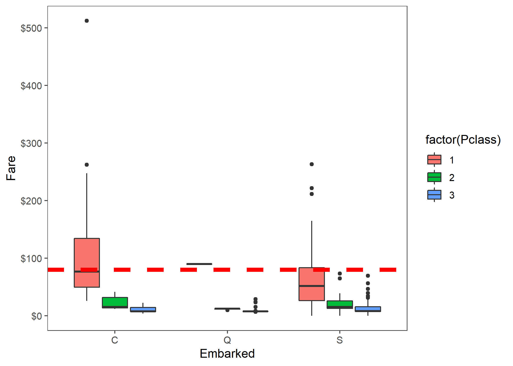
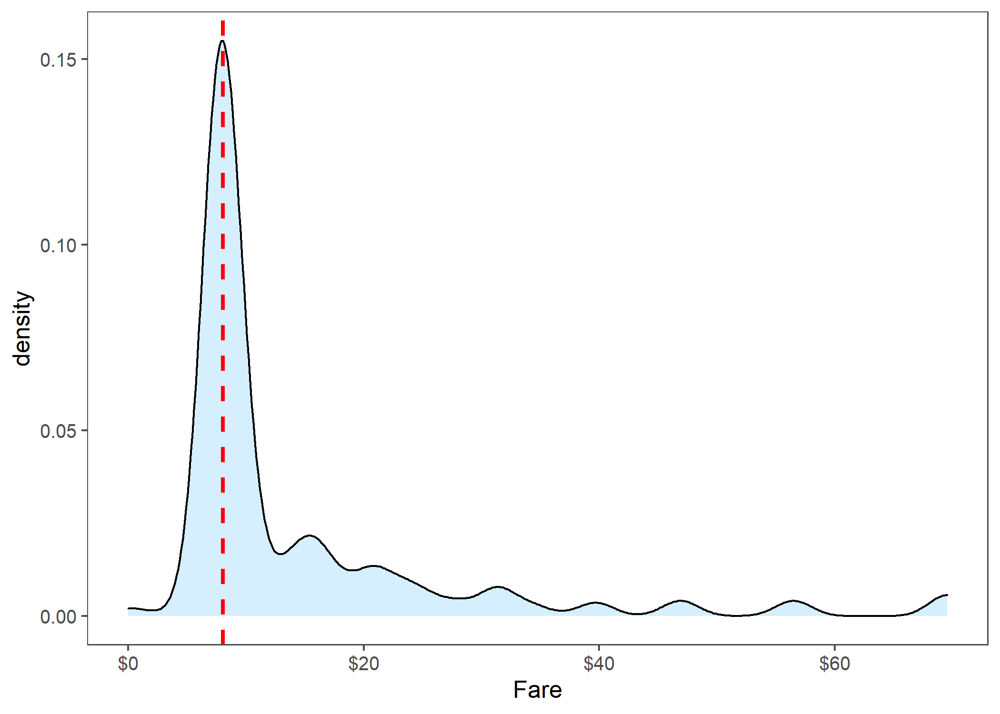
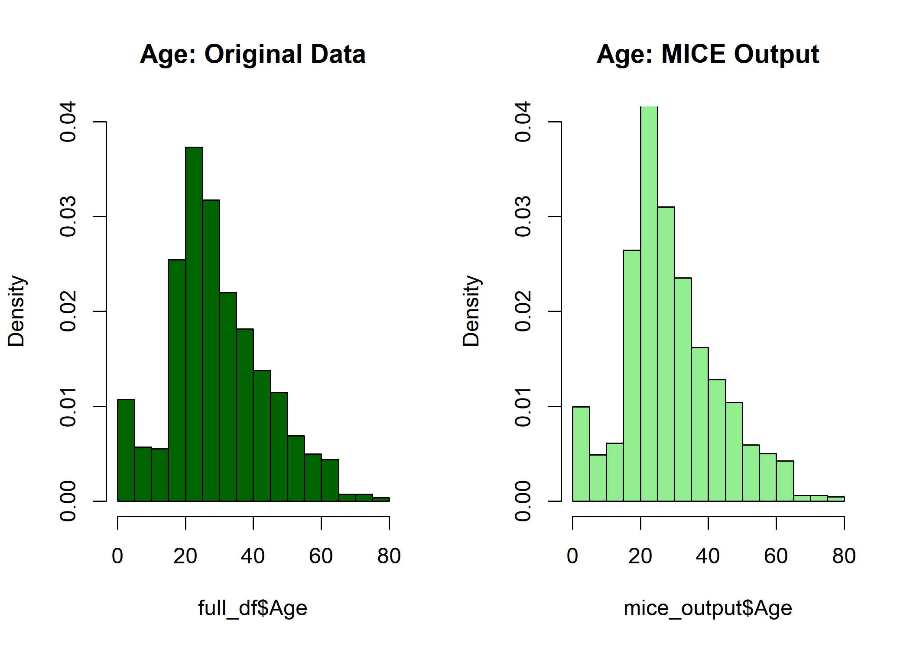
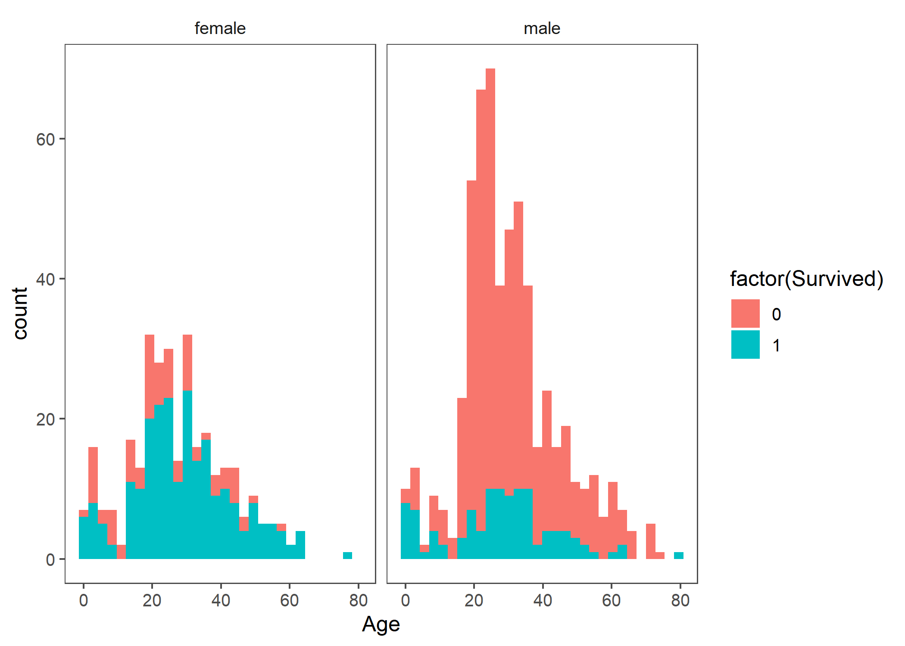
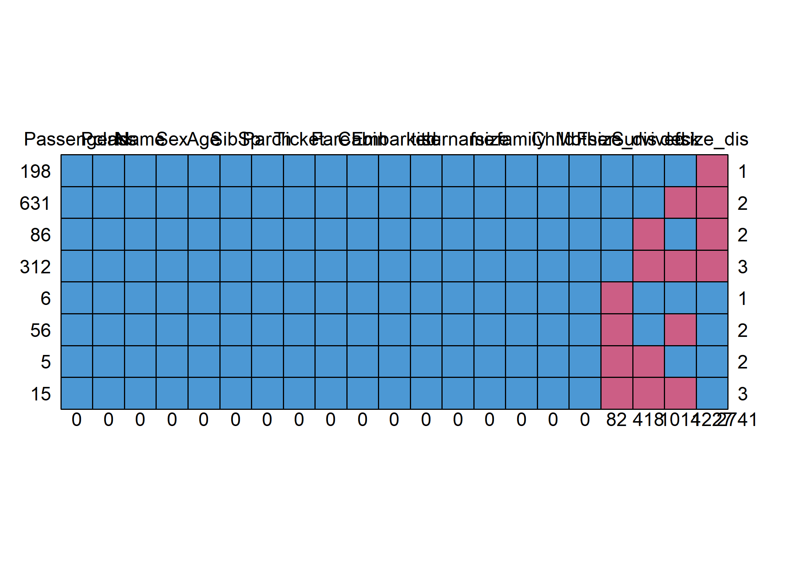
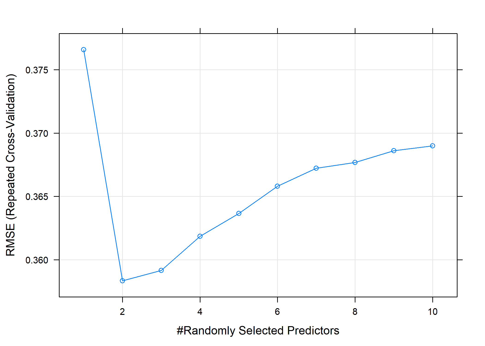

Titanic
================
Jae Kwan Koo

  - [1.1 Load the Library and Check
    data](#load-the-library-and-check-data)
      - [1.2 Glimpse](#glimpse)
      - [1.3 Check the NA, NULL etc..](#check-the-na-null-etc..)
      - [1.4 Summary](#summary)
  - [2.1 Feature Engineering](#feature-engineering)
      - [2.2 family size](#family-size)
      - [2.3 Cabin(객실번호)](#cabin객실번호)
  - [3.1 Missingness](#missingness)
      - [3.2 Embarked(배에 탑승한 위치)](#embarked배에-탑승한-위치)
      - [3.3 Fare](#fare)
      - [3.4 Age](#age)
      - [3.5 Mother](#mother)
      - [finishing feature engineering](#finishing-feature-engineering)
  - [4.1 Prediction](#prediction)
      - [4.2 random forest](#random-forest)
  - [Reference](#reference)
      - [R](#r)
      - [Python](#python)

## 1.1 Load the Library and Check data

``` r
# data manipulate
library(tidyverse)
library(data.table)
library(stringr)
library(mice)

# modeling
library(caret)
library(randomForest)
library(Metrics)

# visualization
library(scales)    # dollar format
library(ggthemes)
library(patchwork) # grid arrange
```

<br>

``` r
train_df <- fread("train.csv", data.table = F)
test_df <- fread("test.csv", data.table = F)

full_df <- bind_rows(train_df, test_df)
```

### 1.2 Glimpse

``` r
dplyr::glimpse(full_df)
```

    ## Rows: 1,309
    ## Columns: 12
    ## $ PassengerId <int> 1, 2, 3, 4, 5, 6, 7, 8, 9, 10, 11, 12, 13, 14, 15, 16, ...
    ## $ Survived    <int> 0, 1, 1, 1, 0, 0, 0, 0, 1, 1, 1, 1, 0, 0, 0, 1, 0, 1, 0...
    ## $ Pclass      <int> 3, 1, 3, 1, 3, 3, 1, 3, 3, 2, 3, 1, 3, 3, 3, 2, 3, 2, 3...
    ## $ Name        <chr> "Braund, Mr. Owen Harris", "Cumings, Mrs. John Bradley ...
    ## $ Sex         <chr> "male", "female", "female", "female", "male", "male", "...
    ## $ Age         <dbl> 22, 38, 26, 35, 35, NA, 54, 2, 27, 14, 4, 58, 20, 39, 1...
    ## $ SibSp       <int> 1, 1, 0, 1, 0, 0, 0, 3, 0, 1, 1, 0, 0, 1, 0, 0, 4, 0, 1...
    ## $ Parch       <int> 0, 0, 0, 0, 0, 0, 0, 1, 2, 0, 1, 0, 0, 5, 0, 0, 1, 0, 0...
    ## $ Ticket      <chr> "A/5 21171", "PC 17599", "STON/O2. 3101282", "113803", ...
    ## $ Fare        <dbl> 7.2500, 71.2833, 7.9250, 53.1000, 8.0500, 8.4583, 51.86...
    ## $ Cabin       <chr> "", "C85", "", "C123", "", "", "E46", "", "", "", "G6",...
    ## $ Embarked    <chr> "S", "C", "S", "S", "S", "Q", "S", "S", "S", "C", "S", ...

str함수의 상위호환인 dplyr::glimpse함수로 컬럼들의 특성을 알 수 있다.

``` r
full_df %>% head
```

    ##   PassengerId Survived Pclass
    ## 1           1        0      3
    ## 2           2        1      1
    ## 3           3        1      3
    ## 4           4        1      1
    ## 5           5        0      3
    ## 6           6        0      3
    ##                                                  Name    Sex Age SibSp Parch
    ## 1                             Braund, Mr. Owen Harris   male  22     1     0
    ## 2 Cumings, Mrs. John Bradley (Florence Briggs Thayer) female  38     1     0
    ## 3                              Heikkinen, Miss. Laina female  26     0     0
    ## 4        Futrelle, Mrs. Jacques Heath (Lily May Peel) female  35     1     0
    ## 5                            Allen, Mr. William Henry   male  35     0     0
    ## 6                                    Moran, Mr. James   male  NA     0     0
    ##             Ticket    Fare Cabin Embarked
    ## 1        A/5 21171  7.2500              S
    ## 2         PC 17599 71.2833   C85        C
    ## 3 STON/O2. 3101282  7.9250              S
    ## 4           113803 53.1000  C123        S
    ## 5           373450  8.0500              S
    ## 6           330877  8.4583              Q

### 1.3 Check the NA, NULL etc..

``` r
purrr::map_dbl(full_df, ~sum(is.na(.x))) # ~ : function, x is denoted by .x
```

    ## PassengerId    Survived      Pclass        Name         Sex         Age 
    ##           0         418           0           0           0         263 
    ##       SibSp       Parch      Ticket        Fare       Cabin    Embarked 
    ##           0           0           0           1           0           0

``` r
# apply(train_df, 2, function(x) sum(is.na(x)))

purrr::map_dbl(full_df, ~sum(.x=="", na.rm = T))
```

    ## PassengerId    Survived      Pclass        Name         Sex         Age 
    ##           0           0           0           0           0           0 
    ##       SibSp       Parch      Ticket        Fare       Cabin    Embarked 
    ##           0           0           0           0        1014           2

``` r
# apply(train_df, 2, function(x) sum(x=="", na.rm = T))
```

apply()로 확인해도 상관없다.  
위의 결과는 결측값의 갯수와 공백으로 된 값들의 갯수를 각각 보여주고 있다.

### 1.4 Summary

``` r
summary(full_df)
```

    ##   PassengerId      Survived          Pclass          Name          
    ##  Min.   :   1   Min.   :0.0000   Min.   :1.000   Length:1309       
    ##  1st Qu.: 328   1st Qu.:0.0000   1st Qu.:2.000   Class :character  
    ##  Median : 655   Median :0.0000   Median :3.000   Mode  :character  
    ##  Mean   : 655   Mean   :0.3838   Mean   :2.295                     
    ##  3rd Qu.: 982   3rd Qu.:1.0000   3rd Qu.:3.000                     
    ##  Max.   :1309   Max.   :1.0000   Max.   :3.000                     
    ##                 NA's   :418                                        
    ##      Sex                 Age            SibSp            Parch      
    ##  Length:1309        Min.   : 0.17   Min.   :0.0000   Min.   :0.000  
    ##  Class :character   1st Qu.:21.00   1st Qu.:0.0000   1st Qu.:0.000  
    ##  Mode  :character   Median :28.00   Median :0.0000   Median :0.000  
    ##                     Mean   :29.88   Mean   :0.4989   Mean   :0.385  
    ##                     3rd Qu.:39.00   3rd Qu.:1.0000   3rd Qu.:0.000  
    ##                     Max.   :80.00   Max.   :8.0000   Max.   :9.000  
    ##                     NA's   :263                                     
    ##     Ticket               Fare            Cabin             Embarked        
    ##  Length:1309        Min.   :  0.000   Length:1309        Length:1309       
    ##  Class :character   1st Qu.:  7.896   Class :character   Class :character  
    ##  Mode  :character   Median : 14.454   Mode  :character   Mode  :character  
    ##                     Mean   : 33.295                                        
    ##                     3rd Qu.: 31.275                                        
    ##                     Max.   :512.329                                        
    ##                     NA's   :1

## 2.1 Feature Engineering

``` r
full_df$title <- gsub("(.*, )|(\\..*)", "", full_df$Name)  # ([A-Za-z]+)\.

full_df$Name %>% head
```

    ## [1] "Braund, Mr. Owen Harris"                            
    ## [2] "Cumings, Mrs. John Bradley (Florence Briggs Thayer)"
    ## [3] "Heikkinen, Miss. Laina"                             
    ## [4] "Futrelle, Mrs. Jacques Heath (Lily May Peel)"       
    ## [5] "Allen, Mr. William Henry"                           
    ## [6] "Moran, Mr. James"

``` r
full_df$title %>% head
```

    ## [1] "Mr"   "Mrs"  "Miss" "Mrs"  "Mr"   "Mr"

이름에는 호칭이 붙기 마련이다. 이 이름들에 대해서 호칭만 가져와 어느 직업군, 성별 등 포괄적으로 알 수 있는 정보를 획득할 수
있다.

<br>

[regular expression practice](https://regexr.com/)

``` r
full_df$title %>% unique
```

    ##  [1] "Mr"           "Mrs"          "Miss"         "Master"       "Don"         
    ##  [6] "Rev"          "Dr"           "Mme"          "Ms"           "Major"       
    ## [11] "Lady"         "Sir"          "Mlle"         "Col"          "Capt"        
    ## [16] "the Countess" "Jonkheer"     "Dona"

``` r
table(full_df$Sex, full_df$title)
```

    ##         
    ##          Capt Col Don Dona  Dr Jonkheer Lady Major Master Miss Mlle Mme  Mr Mrs
    ##   female    0   0   0    1   1        0    1     0      0  260    2   1   0 197
    ##   male      1   4   1    0   7        1    0     2     61    0    0   0 757   0
    ##         
    ##           Ms Rev Sir the Countess
    ##   female   2   0   0            1
    ##   male     0   8   1            0

분할표를 통해 카테고리화를 시킨 이름의 타이틀들을 확인한다.  
흔하지 않은 title은 따로 지정해주는 작업이 필요하다.

``` r
full_df$title[full_df$title == "Mlle"] <- "Miss"
full_df$title[full_df$title == "Ms"] <- "Miss"
full_df$title[full_df$title == "Mme"] <- "Mrs"

`%notin%` <- Negate(`%in%`)

full_df$title[full_df$title %notin% c("Master", "Miss", "Mrs")] <- "Rare_title"

table(full_df$Sex, full_df$title)
```

    ##         
    ##          Master Miss Mrs Rare_title
    ##   female      0  264 198          4
    ##   male       61    0   0        782

확실히 알 수 있는 것들은 분류하고, 나머지 매우 적은 title에 대해서는 Rare\_title에 담아둔다.

``` r
sapply(full_df$Name,  function(x) strsplit(x, split = '[,.]')) %>% head
```

    ## $`Braund, Mr. Owen Harris`
    ## [1] "Braund"       " Mr"          " Owen Harris"
    ## 
    ## $`Cumings, Mrs. John Bradley (Florence Briggs Thayer)`
    ## [1] "Cumings"                               
    ## [2] " Mrs"                                  
    ## [3] " John Bradley (Florence Briggs Thayer)"
    ## 
    ## $`Heikkinen, Miss. Laina`
    ## [1] "Heikkinen" " Miss"     " Laina"   
    ## 
    ## $`Futrelle, Mrs. Jacques Heath (Lily May Peel)`
    ## [1] "Futrelle"                       " Mrs"                          
    ## [3] " Jacques Heath (Lily May Peel)"
    ## 
    ## $`Allen, Mr. William Henry`
    ## [1] "Allen"          " Mr"            " William Henry"
    ## 
    ## $`Moran, Mr. James`
    ## [1] "Moran"  " Mr"    " James"

``` r
# map(full_df$Name, ~strsplit(.x, split = '[,.]')) %>% head

full_df$surname <- sapply(full_df$Name,  function(x) strsplit(x, split = '[,.]')[[1]][1])
```

,와 .를 기준으로 문자를 나누고, 이름만 가져왔다.

### 2.2 family size

``` r
# Create a family size variable including the passenger themselves
full_df$fsize <- full_df$SibSp + full_df$Parch + 1
full_df$fsize %>% head
```

    ## [1] 2 2 1 2 1 1

``` r
# Create a family variable 
full_df$family <- paste(full_df$surname, full_df$fsize, sep='_')
full_df$family %>% head
```

    ## [1] "Braund_2"    "Cumings_2"   "Heikkinen_1" "Futrelle_2"  "Allen_1"    
    ## [6] "Moran_1"

함께 탑승한 형제자매, 아내, 남편의 수와 부모 or 자식의 수를 합하고 +1(자신)을 통해 family size의 형태로
만든다.

마찬가지로 아까 위에서 구한 가족의 이름(외국에서는 가족이름이 존재)와 그에 대한 가족명수를 합친 famliy의 컬럼을 만든다.

``` r
# Use ggplot2 to visualize the relationship between family size & survival

ggplot(full_df, aes(x = fsize, fill = factor(Survived))) +
  geom_bar(stat='count', position='dodge') +
  scale_x_continuous(breaks=c(1:11)) +
  labs(x = 'Family Size') +
  theme_few()
```



가족 크기별 생존 현황이다.

``` r
# Discretize family size
full_df$Fsize_dis[full_df$fsize == 1] <- 'singleton'
full_df$Fsize_dis[full_df$fsize < 5 & full_df$fsize > 1] <- 'small'
full_df$fsize_dis[full_df$fsize > 4] <- 'large'

# Show family size by survival using a mosaic plot
mosaicplot(table(full_df$Fsize_dis, full_df$Survived), 
           main='Family Size by Survival', shade=TRUE)
```



가족 크기가 1인 경우, 5보다 작은 경우, 5이상인 경우로 가족 크기를 소중대로 나누었다.

그리고 모자이크 그림으로 쉽게 확인할 수 있다.

  - dtree3패키지를 쓰는게 더 좋아보인다.

### 2.3 Cabin(객실번호)

``` r
# This variable appears to have a lot of missing values
full_df$Cabin[1:28]
```

    ##  [1] ""            "C85"         ""            "C123"        ""           
    ##  [6] ""            "E46"         ""            ""            ""           
    ## [11] "G6"          "C103"        ""            ""            ""           
    ## [16] ""            ""            ""            ""            ""           
    ## [21] ""            "D56"         ""            "A6"          ""           
    ## [26] ""            ""            "C23 C25 C27"

많은 결측값들이 존재하는 모습

``` r
strsplit(full_df$Cabin[2], NULL) # [[1]]
```

    ## [[1]]
    ## [1] "C" "8" "5"

``` r
# Create a Deck variable. Get passenger deck A - F:
full_df$deck <- factor(map_chr(full_df$Cabin, ~strsplit(.x, NULL)[[1]][1]))


full_df$deck %>% head
```

    ## [1] <NA> C    <NA> C    <NA> <NA>
    ## Levels: A B C D E F G T

C85를 한글자씩 분리해서 앞자리의 객실 등급만 가져오는게 좋아보인다.

솔직히 방번호와 그에 따른 위치를 알고, 침몰이 어느 방향으로 이루어져 어느 방과 가까운지를 알면 더 예측 정확도를 올릴 수
있겠지만, 사실상 그렇지 못하다.

테스트를 한 후에 모든 문자에 대해 적용시켰다.  
원래 없던 것들은 그냥 <NA>로 나오고 있다. chr로 적용시켰기 때문에 <NA>문자형을 보인다.

## 3.1 Missingness

Now, we’re ready to start exploring missing data and rectifying it
through imputation. There are a number of different ways we could go
about doing this. Given the small size of the dataset, we probably sould
not opt for deleting either entire observations (rows) or variables
(columns) containing missing values. We’re left with the option of
either replacing missing values with a sensible values given the
distribution of the dat, e.g, the mean, median or mode. Finally, we
could go with prediction. We’ll use both of the two latter methods and
i’ll rely on some data visualization to guide our decisions.

### 3.2 Embarked(배에 탑승한 위치)

C : Cherbourg, Q : Queenstown, S : Southampton

``` r
full_df$Embarked %>% unique
```

    ## [1] "S" "C" "Q" ""

``` r
which(full_df$Embarked=="")
```

    ## [1]  62 830

``` r
full_df[full_df$Embarked=="",] 
```

    ##     PassengerId Survived Pclass                                      Name
    ## 62           62        1      1                       Icard, Miss. Amelie
    ## 830         830        1      1 Stone, Mrs. George Nelson (Martha Evelyn)
    ##        Sex Age SibSp Parch Ticket Fare Cabin Embarked title surname fsize
    ## 62  female  38     0     0 113572   80   B28           Miss   Icard     1
    ## 830 female  62     0     0 113572   80   B28            Mrs   Stone     1
    ##      family Fsize_dis fsize_dis deck
    ## 62  Icard_1 singleton      <NA>    B
    ## 830 Stone_1 singleton      <NA>    B

``` r
# Get rid of our missing passenger IDs
embark_fare <- full_df %>%
  filter(PassengerId != 62 & PassengerId != 830)
```

Embarked의 비어있는 곳은 62번째와 830번째이다. 2개 정도는 비슷한 값을 추론하여 채워넣을 수 있을 것 같다.

빈 값을 제외한 데이터셋을 만들어 그래프로 유추해보기로 하자.

``` r
full_df[c(62,830),"Fare"]
```

    ## [1] 80 80

``` r
# Use ggplot2 to visualize embarkment, passenger class, & median fare
ggplot(embark_fare, aes(x = Embarked, y = Fare, fill = factor(Pclass))) +
  geom_boxplot() +
  geom_hline(aes(yintercept=80), 
    colour='red', linetype='dashed', lwd=2) +
  scale_y_continuous(labels=dollar_format()) +
  theme_few()
```


Embarked가 ""인 값 2개의 Fare는 80이다. 여기서 80불에 대한 horizon line을 그었을 떄,
Embarked가 C이고 1등석(Pclass가 1)인 median과 겹친다. 따라서 Full\_df의 62와 830행
Embarked를 C로 유추하여 채워두기로 한다.

비슷한 요금을 지불했으므로 그 객실 등석이라고 생각한 것이다.

``` r
# Since their fare was $80 for 1st class, they most likely embarked from 'C'
full_df$Embarked[c(62, 830)] <- 'C'
```

### 3.3 Fare

``` r
# Show row 1044
full_df[1044, ]
```

    ##      PassengerId Survived Pclass               Name  Sex  Age SibSp Parch
    ## 1044        1044       NA      3 Storey, Mr. Thomas male 60.5     0     0
    ##      Ticket Fare Cabin Embarked      title surname fsize   family Fsize_dis
    ## 1044   3701   NA              S Rare_title  Storey     1 Storey_1 singleton
    ##      fsize_dis deck
    ## 1044      <NA> <NA>

탑승 위치가 S이며, 객실 등급은 3등급인 사람의 요금이 현재 결측치이다.  
이것도 마찬가지로 유추하여 넣어보자.

``` r
ggplot(full_df[full_df$Pclass == '3' & full_df$Embarked == 'S',], 
  aes(x = Fare)) +
  
  geom_density(fill = '#99d6ff', alpha=0.4) + 
  geom_vline(aes(xintercept=median(Fare, na.rm=T)),
    colour='red', linetype='dashed', lwd=1) +
  scale_x_continuous(labels=dollar_format()) +
  theme_few()
```



3등급이며 S인 사람들에 대해서 요금에 대한 밀도함수 그래프이다.  
우리는 이 결측치를 이 사람들의 median으로 채워넣기로 한다.

``` r
# Replace missing fare value with median fare for class/embarkment
full_df$Fare[1044] <- median(full_df[full_df$Pclass == '3' & full_df$Embarked == 'S', ]$Fare, na.rm = TRUE)
```

### 3.4 Age

``` r
# Show number of missing Age values
sum(is.na(full_df$Age))
```

    ## [1] 263

나이의 결측값 갯수

``` r
# Make variables factors into factors
factor_vars <- c('PassengerId','Pclass','Sex','Embarked',
                 'title','surname','family','fsize')

full_df[factor_vars] <- lapply(full_df[factor_vars], factor)


# Set a random seed
set.seed(129)

# Perform mice imputation, excluding certain less-than-useful variables:
mice_mod <- mice(full_df[, !names(full_df) %in%
                    c('PassengerId','Name','Ticket','Cabin','Family',
                      'Surname','Survived')], method='rf') 
```

    ## 
    ##  iter imp variable
    ##   1   1  Age  deck
    ##   1   2  Age  deck
    ##   1   3  Age  deck
    ##   1   4  Age  deck
    ##   1   5  Age  deck
    ##   2   1  Age  deck
    ##   2   2  Age  deck
    ##   2   3  Age  deck
    ##   2   4  Age  deck
    ##   2   5  Age  deck
    ##   3   1  Age  deck
    ##   3   2  Age  deck
    ##   3   3  Age  deck
    ##   3   4  Age  deck
    ##   3   5  Age  deck
    ##   4   1  Age  deck
    ##   4   2  Age  deck
    ##   4   3  Age  deck
    ##   4   4  Age  deck
    ##   4   5  Age  deck
    ##   5   1  Age  deck
    ##   5   2  Age  deck
    ##   5   3  Age  deck
    ##   5   4  Age  deck
    ##   5   5  Age  deck

factor형태의 변수들은 factor로 바꾼다.  
결측치를 채울 변수들에 대해서 random forest 알고리즘을 이용해 채운다.

``` r
# Save the complete output 
mice_output <- complete(mice_mod)

head(mice_output)
```

    ##   Pclass    Sex Age SibSp Parch    Fare Embarked      title   surname fsize
    ## 1      3   male  22     1     0  7.2500        S Rare_title    Braund     2
    ## 2      1 female  38     1     0 71.2833        C        Mrs   Cumings     2
    ## 3      3 female  26     0     0  7.9250        S       Miss Heikkinen     1
    ## 4      1 female  35     1     0 53.1000        S        Mrs  Futrelle     2
    ## 5      3   male  35     0     0  8.0500        S Rare_title     Allen     1
    ## 6      3   male  34     0     0  8.4583        Q Rare_title     Moran     1
    ##        family Fsize_dis fsize_dis deck
    ## 1    Braund_2     small      <NA>    B
    ## 2   Cumings_2     small      <NA>    C
    ## 3 Heikkinen_1 singleton      <NA>    B
    ## 4  Futrelle_2     small      <NA>    C
    ## 5     Allen_1 singleton      <NA>    C
    ## 6     Moran_1 singleton      <NA>    E

``` r
map_dbl(mice_output,~sum(is.na(.x)))
```

    ##    Pclass       Sex       Age     SibSp     Parch      Fare  Embarked     title 
    ##         0         0         0         0         0         0         0         0 
    ##   surname     fsize    family Fsize_dis fsize_dis      deck 
    ##         0         0         0        82      1227         0

random forest방법을 이용해 결측값을 채워넣고, 결측값 갯수를 컬럼별로 확인하였다.  
나이는 더 이상 결측값이 존재하지 않는다.

``` r
# Plot age distributions
par(mfrow=c(1,2))

hist(full_df$Age, freq=F, main='Age: Original Data', 
  col='darkgreen', ylim=c(0,0.04))

hist(mice_output$Age, freq=F, main='Age: MICE Output', 
  col='lightgreen', ylim=c(0,0.04))
```



결측치를 채우기 전, 후에 대한 히스토그램이다.  
비슷한 양상으로 채워졌다.

``` r
# Replace Age variable from the mice model.
full_df$Age <- mice_output$Age

# Show new number of missing Age values
sum(is.na(full_df$Age))
```

    ## [1] 0

``` r
# First we'll look at the relationship between age & survival
ggplot(full_df[1:891,], aes(Age, fill = factor(Survived))) + 
  geom_histogram() + 
  # I include Sex since we know (a priori) it's a significant predictor
  facet_grid(.~Sex) + 
  theme_few()
```



나이에 따른 생존 여부를 성별과 나타내었다.

``` r
# Create the column child, and indicate whether child or adult
full_df$Child[full_df$Age < 18] <- 'Child'
full_df$Child[full_df$Age >= 18] <- 'Adult'

# Show counts
table(full_df$Child, full_df$Survived)
```

    ##        
    ##           0   1
    ##   Adult 480 275
    ##   Child  69  67

18세를 기준으로 이상이면 성인, 아니면 어린이라고 분류하였다.  
생존여부와 성인여부에 대한 table을 확인할 수 있다.

어린이라고해서 반드시 생존하는 것은 아님을 알 수 있다.  
Mother변수를 만드면서 feature engineering을 마무리하자  
엄마가 타이타닉에서 살아남을 가능성이 더 높기를 바라는 소망이 담겨있다.

### 3.5 Mother

``` r
# Adding Mother variable
full_df$Mother <- 'Not Mother'
full_df$Mother[full_df$Sex == 'female' & full_df$Parch > 0 & full_df$Age > 18 & full_df$title != 'Miss'] <- 'Mother'

# Show counts
table(full_df$Mother, full_df$Survived)
```

    ##             
    ##                0   1
    ##   Mother      16  39
    ##   Not Mother 533 303

먼저 모든 값에 Not Mother을 대입하고, 조건에 맞는 값에 Mother을 넣으면 된다.

여성이면서 함께 탑승한 부모, 자식의 수가 0보다 크며(자식이 있어야 엄마임), 성인이면서 Miss가 아닌 사람들(결혼하면
Miss를 쓰지않음)은 엄마이다.

``` r
# Finish by factorizing our two new factor variables
full_df$Child  <- factor(full_df$Child)
full_df$Mother <- factor(full_df$Mother)
```

factor형으로 바꿔준다.

### finishing feature engineering

All of the variables we care about should be taken care of and there
should be no missing data. I’am going to double check just to be sure.

``` r
md.pattern(full_df)
```



    ##     PassengerId Pclass Name Sex Age SibSp Parch Ticket Fare Cabin Embarked
    ## 198           1      1    1   1   1     1     1      1    1     1        1
    ## 631           1      1    1   1   1     1     1      1    1     1        1
    ## 86            1      1    1   1   1     1     1      1    1     1        1
    ## 312           1      1    1   1   1     1     1      1    1     1        1
    ## 6             1      1    1   1   1     1     1      1    1     1        1
    ## 56            1      1    1   1   1     1     1      1    1     1        1
    ## 5             1      1    1   1   1     1     1      1    1     1        1
    ## 15            1      1    1   1   1     1     1      1    1     1        1
    ##               0      0    0   0   0     0     0      0    0     0        0
    ##     title surname fsize family Child Mother Fsize_dis Survived deck fsize_dis
    ## 198     1       1     1      1     1      1         1        1    1         0
    ## 631     1       1     1      1     1      1         1        1    0         0
    ## 86      1       1     1      1     1      1         1        0    1         0
    ## 312     1       1     1      1     1      1         1        0    0         0
    ## 6       1       1     1      1     1      1         0        1    1         1
    ## 56      1       1     1      1     1      1         0        1    0         1
    ## 5       1       1     1      1     1      1         0        0    1         1
    ## 15      1       1     1      1     1      1         0        0    0         1
    ##         0       0     0      0     0      0        82      418 1014      1227
    ##         
    ## 198    1
    ## 631    2
    ## 86     2
    ## 312    3
    ## 6      1
    ## 56     2
    ## 5      2
    ## 15     3
    ##     2741

## 4.1 Prediction

``` r
train_df <- full_df[1:891,]
test_df <- full_df[892:1309,]
```

full\_df로 모든 작업을 마친 후, 다시 원래 있던 train set, test set으로 나누어 준다.

``` r
colnames(train_df)
```

    ##  [1] "PassengerId" "Survived"    "Pclass"      "Name"        "Sex"        
    ##  [6] "Age"         "SibSp"       "Parch"       "Ticket"      "Fare"       
    ## [11] "Cabin"       "Embarked"    "title"       "surname"     "fsize"      
    ## [16] "family"      "Fsize_dis"   "fsize_dis"   "deck"        "Child"      
    ## [21] "Mother"

``` r
library(doSNOW)
library(parallel)

num_cores <- parallel:::detectCores()

cl <- makeCluster(num_cores-1, type = "SOCK")
registerDoSNOW(cl)
```

1개의 코어는 다른 일을 하도록 두고 나머지 코어들을 모형 연산에 집중시켰다.

### 4.2 random forest

``` r
var <-  c("Pclass", "Sex", "Age", "SibSp", "Parch", "Fare", 
          "Embarked", "title", "fsize", "Child", "Mother")

set.seed(100)

control <- trainControl(method="repeatedcv", 
                        number = 10, 
                        repeats = 3,
                        index = createMultiFolds(train_df$Survived,
                                                 k=5, 
                                                 times = 3))
customGrid <- expand.grid(mtry = 1:10)
rf <- train(x = train_df[,var], y = train_df$Survived, 
            method = "rf", 
            importance=TRUE,
            trControl = control,
            tuneGrid = customGrid,
            verbose = F,
            preProcess = c("center", "scale"))

rf$results
```

    ##    mtry      RMSE  Rsquared       MAE     RMSESD RsquaredSD       MAESD
    ## 1     1 0.3765763 0.4454092 0.3284357 0.01046880 0.03428570 0.006646445
    ## 2     2 0.3583460 0.4588580 0.2678547 0.01119115 0.03404285 0.006896449
    ## 3     3 0.3591565 0.4548504 0.2546994 0.01075258 0.03420857 0.008702107
    ## 4     4 0.3618434 0.4473667 0.2509355 0.01115044 0.03667723 0.010181228
    ## 5     5 0.3636486 0.4430866 0.2487851 0.01090261 0.03621263 0.010769225
    ## 6     6 0.3658096 0.4379253 0.2475019 0.01120730 0.03723475 0.011216062
    ## 7     7 0.3672222 0.4342951 0.2470623 0.01213877 0.04001074 0.012018363
    ## 8     8 0.3676773 0.4335591 0.2460795 0.01169036 0.03937856 0.012257025
    ## 9     9 0.3686096 0.4312650 0.2458304 0.01185628 0.03918643 0.011685487
    ## 10   10 0.3689955 0.4305495 0.2453450 0.01230391 0.03972413 0.012212759

``` r
rf$bestTune
```

    ##   mtry
    ## 2    2

random forest를 활용한 repeat cross validation 방법을 이용해 모형을 구축

  - 5 fold  
  - 3 repeat  
  - 변수별 scaling을 진행

<!-- end list -->

``` r
plot(rf)
```



``` r
# Predict using the test set
prediction <- predict(rf, test_df)

prediction <- ifelse(prediction>0.5,1,0)
```

``` r
result <- data.frame(PassengerId = test_df$PassengerId, Survived = prediction)

result %>% head(10)
```

    ##     PassengerId Survived
    ## 892         892        0
    ## 893         893        0
    ## 894         894        0
    ## 895         895        0
    ## 896         896        1
    ## 897         897        0
    ## 898         898        1
    ## 899         899        0
    ## 900         900        1
    ## 901         901        0

``` r
# Write the solution to file
fwrite(result, file = 'rf_caret.csv', row.names = F)
```

## Reference

### R

<https://www.kaggle.com/mrisdal/exploring-survival-on-the-titanic>

<https://www.kaggle.com/headsortails/tidy-titarnic>

<br>

### Python

<https://www.kaggle.com/startupsci/titanic-data-science-solutions>
